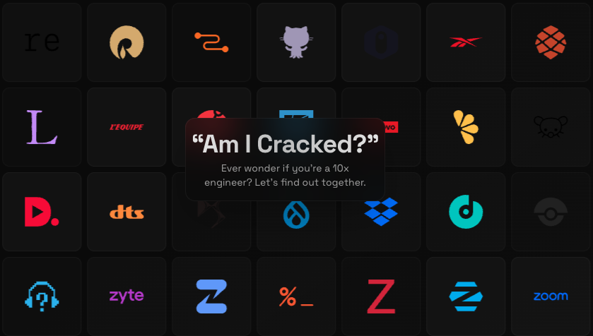

# [amicracked.com](https://amicracked.com)




A fun quiz to see if you're truly the mythical "cracked" 10x engineer.

## Setup

```bash
npm install -g bun
bun install
touch .env.local
echo "OPENAI_API_KEY=your_api_key" > .env.local
```

Get a key from [OpenAI](https://platform.openai.com/account/api-keys) then finally run the development server.

```bash
bun dev
```

## License

[MIT](./LICENSE)